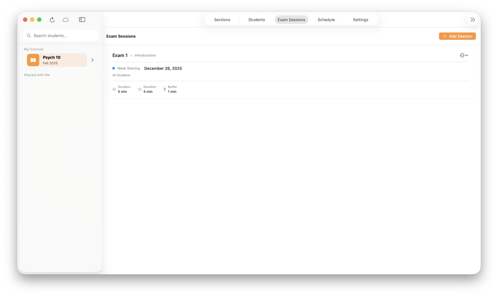
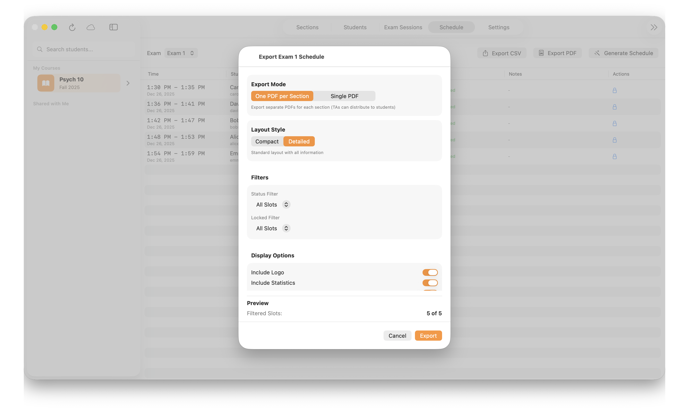
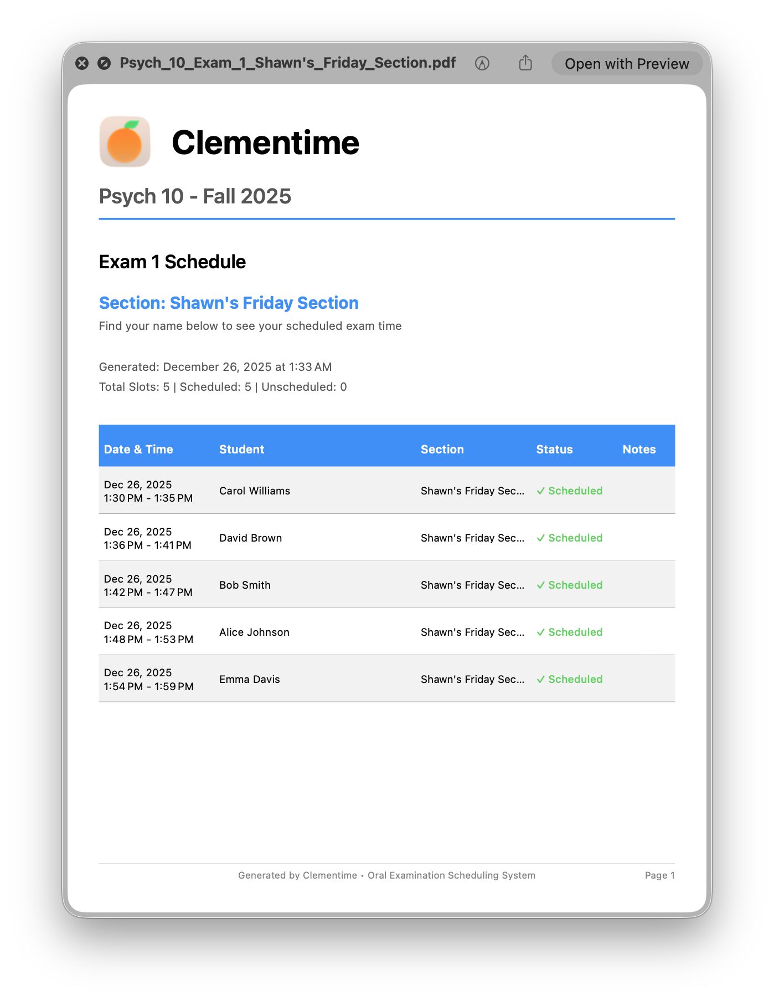
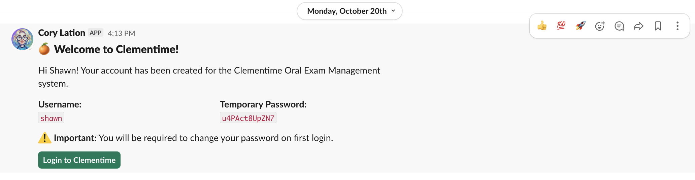
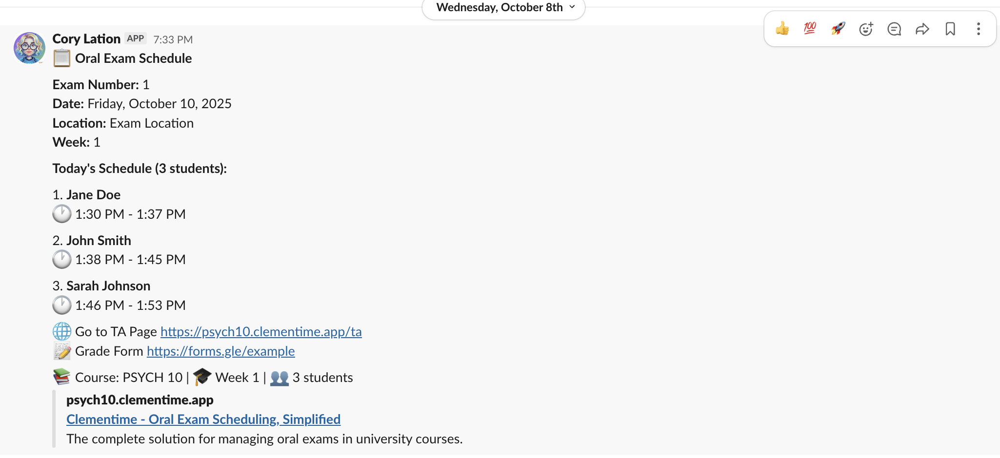

<div align="center">


# Clementime

### 🍊 Multi-platform Oral Exam Scheduler for Universities

[](https://clementime.app)
[](https://www.apple.com/macos/)
[](https://swift.org)
[](https://www.ruby-lang.org/)
[](https://rubyonrails.org/)
[](https://hub.docker.com/r/shawnschwartz/clementime)
[](./LICENSE)
[](https://github.com/shawntz/clementime/stargazers)

**Available as a full-stack Rails/React web application with Slack integration and real-time notifications, and as a native Swift macOS app with CloudKit sync. Both platforms feature constraint-based scheduling, instructor dashboards, and cloud recording support.**

[Mac App](./clementime-mac) • [Web App](#-web-application) • [Documentation](./clementime-mac/README.md) • [Releases](https://github.com/shawntz/clementime/releases)

</div>

---

## Table of Contents

- [Platform Overview](#platform-overview)
  - [📱 macOS Application](#-clementime-mac)
  - [🌐 Web Application](#-web-application)
- [Choosing a Platform](#choosing-a-platform)
- [Platform Comparison](#platform-comparison-key-differences)
- [Quick Start](#quick-start)
- [Student Roster Import](#student-roster-import)
- [Features Comparison](#features-comparison)
- [Architecture](#architecture)
- [Development Timeline](#development-timeline)
- [Releases](#releases)
- [Contributing](#contributing)
- [Support](#support)
- [License](#license)
- [Acknowledgments](#acknowledgments)

---

## Platform Overview

This repository contains **two independent implementations** of Clementime, each with distinct strengths:

### 📱 [clementime-mac](./clementime-mac)
**Native macOS Application** (Swift + SwiftUI + CloudKit)

A modern, offline-first Mac app designed for instructors who prefer native tools and iCloud integration.

**Key Features:**
- 🎨 Native SwiftUI interface optimized for macOS
- ☁️ Automatic iCloud sync with CloudKit
- 📴 Full offline support with Core Data
- 🎭 Unlimited custom cohorts (not limited to odd/even)
- 🔐 Granular TA permission system (8 permission types)
- 🎙️ Built-in audio recording with iCloud storage
- 📤 Course export/import (.clementime files)
- 🤝 Course sharing via CloudKit Share

**Requirements**: macOS 15.0+

**Status**: ✅ Active development - Core features implemented

[📖 Read Mac App Documentation →](./clementime-mac/README.md)

**Screenshots:**


*Main course dashboard with cohort management and exam sessions*




*Constraint-based schedule generation*

---

### 🌐 Web Application
**Full-Stack Rails + React** (PostgreSQL + Redis)

A comprehensive web-based solution with multi-user collaboration, real-time notifications, and LMS integration.

**Key Features:**
- 🌍 Cross-platform web access (any browser)
- 💬 Real-time Slack notifications for schedule changes
- 📚 Canvas LMS integration for roster imports
- 👥 Multi-user admin dashboards
- 📊 PostgreSQL database with Redis caching
- 🎙️ Browser-based audio recording
- ☁️ Cloud storage (Google Drive / Cloudflare R2)

**Requirements**: Ruby 3.4.6+, Rails 8.1.1+, PostgreSQL, Node.js

**Status**: ✅ Stable production deployment

**Note**: Web app code is located in the root directory (`/app`, `/client`, `/config`, etc.). Not currently in a subfolder.

**Screenshots:**


*Multi-user admin dashboard with real-time updates*



*Automated Slack notifications for schedule changes*

---

## Choosing a Platform

Both implementations share the same core scheduling algorithm but operate **completely independently**:

| Use the **Mac App** if you... | Use the **Web App** if you... |
|-------------------------------|-------------------------------|
| Want native macOS performance | Need cross-platform browser access |
| Prefer iCloud sync | Already use web servers / S3 storage |
| Work offline frequently | Want Slack-API notifications support |
| Need unlimited cohorts | Need Canvas LMS integration |
| Want granular permissions | Have an existing Rails infrastructure |
| Prefer standalone desktop-first (local) workflow | Need multi-user real-time collaboration (online) |

> **💡 Tip**: Both platforms can export/import course data, so you can experiment with either approach.

## Platform Comparison: Key Differences

While both platforms solve the same problem, they take different architectural approaches:

### Mac App Advantages
- ✅ No external backend dependencies (self-contained)
- ✅ Automatic iCloud sync (zero configuration)
- ✅ Unlimited custom cohorts (flexible scheduling)
- ✅ Unlimited exam sessions (not capped at 5)
- ✅ Granular TA permissions (8 distinct permission types)
- ✅ Native performance and full offline support

### Web App Advantages
- ✅ Cross-platform access (works on any OS)
- ✅ Slack integration (automated notifications)
- ✅ Canvas LMS integration (direct roster sync)
- ✅ Multi-user real-time collaboration
- ✅ Proven production stability

## Quick Start

### Mac App (Recommended)

```bash
cd clementime-mac
open ClemenTime.xcodeproj
```

Follow the [Mac App Setup Guide](./clementime-mac/CORE_DATA_MODEL_SETUP.md).

### Web App (Legacy)

```bash
cd clementime-web
bin/setup
bin/dev
```

## Deployment

Ready to deploy ClemenTime at your institution?

- 🚀 **[Quick Start Guide](./docs/QUICK_START.md)** - Get running in 10 minutes
- 📚 **[Full Deployment Guide](./docs/DEPLOYMENT_GUIDE.md)** - Complete deployment documentation
- 🐳 **Docker Hub**: [shawnschwartz/clementime](https://hub.docker.com/r/shawnschwartz/clementime)

**Recommended platforms:**
- Render
- Docker

## Student Roster Import

Both platforms support CSV roster imports, but use different formats:

### Mac App Format

```csv
sis_user_id,email,full_name,section_code
student001,alice@fakeuni.edu,Alice Johnson,F25-PSYCH-10-01
student002,bob@fakeuni.edu,Bob Smith,F25-PSYCH-10-02
student003,carol@fakeuni.edu,Carol Williams,F25-PSYCH-10-01
student004,david@fakeuni.edu,David Brown,F25-PSYCH-10-02
```

**[Download Mac App Example CSV](./docs/examples/roster-mac-example.csv)**

### Web App Format (Canvas Export Compatible)

```csv
Student,SIS User ID,SIS Login ID,Section
"Johnson, Alice Marie",student001,alice.johnson@fakeuni.edu,F25-PSYCH-10-01
"Smith, Bob Thomas",student002,bob.smith@fakeuni.edu,F25-PSYCH-10-02
"Williams, Carol Ann",student003,carol.williams@fakeuni.edu,F25-PSYCH-10-01
"Brown, David Lee",student004,david.brown@fakeuni.edu,F25-PSYCH-10-02
```

**[Download Web App Example CSV](./docs/examples/roster-web-example.csv)**

> **Note**: The web app format matches Canvas LMS gradebook export format.
>
> **To export from Canvas**: Go to your Canvas course → **Grades** → **Export** → **Export Entire Gradebook**. Upload the downloaded CSV directly to Clementime - extra columns will be ignored. The app will also merge with Slack member data if Slack integration is enabled.

### Slack Integration (Web App Only)

To enable Slack notifications, export your workspace members and import them into Clementime:

**How to export Slack members**:
1. Slack workspace → Settings & administration → Workspace settings
2. Import/Export Data → Export member list
3. Download and import into Clementime

**[Download Slack Members Example CSV](./docs/examples/slack-members-example.csv)**

Students are matched with Slack members by email address, enabling automated direct message notifications for schedule changes.

## Features Comparison

| Feature | Mac App | Web App |
|---------|---------|---------|
| Platform | macOS 15.0+ | Web (any browser) |
| Backend | iCloud (CloudKit) | Rails + PostgreSQL |
| Offline Support | ✅ Full | ❌ No |
| Cohorts | ∞ Unlimited | 2 (odd/even) |
| Exam Limit | ∞ Unlimited | 5 exams |
| Permissions | Granular (8 types) | Basic (admin/TA) |
| Audio Recording | ✅ Built-in | ✅ Via browser |
| File Storage | iCloud | Google Drive / R2 |
| Slack Integration | 🚧 Planned | ✅ Yes |
| Canvas Integration | 🚧 Planned | ✅ Yes |
| Share Courses | ✅ CloudKit Share | ❌ No |
| Real-time Sync | ✅ Automatic | ❌ Manual refresh |

## Architecture

### Mac App Architecture

```
SwiftUI Views + ViewModels (Presentation)
    ↓
Use Cases + Entities (Domain)
    ↓
Repositories + Core Data (Data)
    ↓
CloudKit + AVFoundation (Infrastructure)
```

### Web App Architecture

```
React Components (Frontend)
    ↓
Rails API (Backend)
    ↓
PostgreSQL + Redis (Storage)
    ↓
S3 Storage + Slack (Integrations)
```

## Releases

Both the Mac app and Web app are released together using automated GitHub Actions workflows.

### Creating a Release

```bash
# Quick release (patch version bump)
./scripts/release.sh

# Feature release (minor version bump)
./scripts/release.sh minor

# Breaking changes (major version bump)
./scripts/release.sh major
```

Each release automatically:
- 🐳 Builds and publishes Docker image for web app
- 💻 Builds macOS DMG installer
- 🌐 Builds static web assets
- 📝 Creates GitHub release with changelog
- 🔖 Tags release with version number

See [RELEASE.md](./RELEASE.md) for detailed documentation.

### Downloading Releases

- **GitHub Releases**: https://github.com/shawntz/clementime/releases
- **Docker Hub**: https://hub.docker.com/r/shawnschwartz/clementime

## Contributing

Contributions are welcome! This project is designed to help university instructors efficiently manage (oral) exam scheduling.

### How to Contribute

1. Fork the repository
2. Create a feature branch (`git checkout -b feature/amazing-feature`)
3. Commit your changes (`git commit -m 'Add amazing feature'`)
4. Push to the branch (`git push origin feature/amazing-feature`)
5. Open a Pull Request

### Reporting Issues

Found a bug or have a feature request? Please [open an issue](https://github.com/shawntz/clementime/issues) with:
- A clear description of the problem or feature
- Steps to reproduce (for bugs)
- Expected vs actual behavior
- Screenshots if applicable

---

## Support

Need help or have questions?

- 📖 [Read the Documentation](./clementime-mac/README.md)
- 🐛 [Report a Bug](https://github.com/shawntz/clementime/issues/new?template=bug_report.md)
- 💡 [Request a Feature](https://github.com/shawntz/clementime/issues/new?template=feature_request.md)
- 💬 [Discussions](https://github.com/shawntz/clementime/discussions)

---

## License

Copyright © 2025 Shawn Schwartz

This project is licensed under the [MIT License](./LICENSE).

---

## Acknowledgments

- Built with ❤️ for university instructors managing (oral) exam scheduling
- Inspired by the need for flexible, offline-capable scheduling tools
- Special thanks to the SwiftUI and Rails communities

---

<div align="center">

**⚠️ Project Status**: The web app (`/app`, `/client`) is in maintenance mode. All new features are being developed for the Mac app (`clementime-mac`).

Made with 🍊 by [Shawn Schwartz](https://shawnschwartz.com)

</div>
